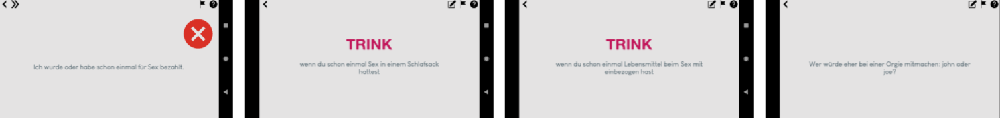

# Apps
## A collection of my Android apps which have been removed from Play Store

- coronatracker.apk: covid-19 tracker providing data from the JHU (corona trackers in gerneral are somehow not allowed in the Play Store)
- freitags.apk: das Trinkspiel
  - wurde entfernt aus Play Store wegen Verstoß gegen die ["Sexual Content and Profanity policy"](https://support.google.com/googleplay/android-developer/answer/9878810#sexual-content)
  - der Verstoß wurde mir in diesen Screenshots zugesendet (wtf?!) 
